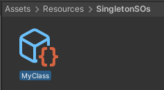
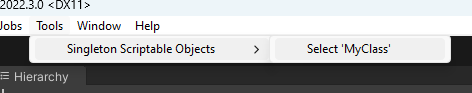

# Singleton Scriptable Object
### ✍️ All You Have To Do is

-  `partial class MyClass : SingletonScriptableObject { }`

### 👌And You'll Get To:
1. Access it by `MyClass.Instance`
2. Edit it from inspector at *Assets/Resources/SingletonSOs/MyClass*  
  
3. Select the instance by toolbar buttons at *'Tools/Singleton Scriptable Objects/Select 'MyClass'*  


That's it! The rest is source generated and handled automatically!

The goal of this project is to provide a singleton scriptable object solution that has the easiest usage APIs and doesn't get in the way of your workflow. 

## 🔔 Extra
* You can find the source gen project at [here](https://github.com/somedeveloper00/UnityModelViewAnalyzer.git).
* Renaming type names are **totally supported!**
* Exchanging two types' names is **totally supported!**

## ⚒️ Install

### UPM
You can install this as a unity package by following the instructions at [the official manual](https://docs.unity3d.com/Manual/upm-ui-giturl.html). 
> The package url is `https://github.com/somedeveloper00/SingletonScriptableObject.git`

### Git Submodule
clone the repository into your project's Assets/Plugins folder as a submodule:
```bash
git submodule add --force https://github.com/somedeveloper00/SingletonScriptableObject/ Assets/Plugins/SingletonScriptableObject
git submodule update Assets/Plugins/SingletonScriptableObject
```
or if you don't have git, simply download the zip and extract it into your project's Assets/Plugins folder:
> Linux / MacOS
> ```
> wget https://github.com/somedeveloper00/SingletonScriptableObject/archive/refs/heads/main.zip -O SingletonScriptableObject.zip
> unzip SingletonScriptableObject.zip -d Assets/Plugins
> rm SingletonScriptableObject.zip

## 🙌 Support
If you like my work, you can buy me a coffee to keep me motivated to work on this project and other projects like this. 
My wallet addresses are: 
* BTC: `bc1q808ykgvhn2ewtx09n3kdhnlmcnc6xqwxa0hnys`
* ETH: `0xCe7028266Cf3eF0E63437d0604511e30f8e4B4Af`
* LTC: `ltc1qlu2jahcdr5kqf5dp9xt3zr3cv66gm2p8hmnz9j`

## 📝 License
This project is licensed under the MIT License - see the [LICENSE](LICENSE) file for details.